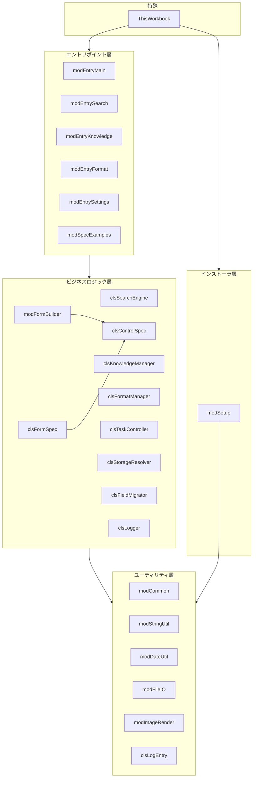
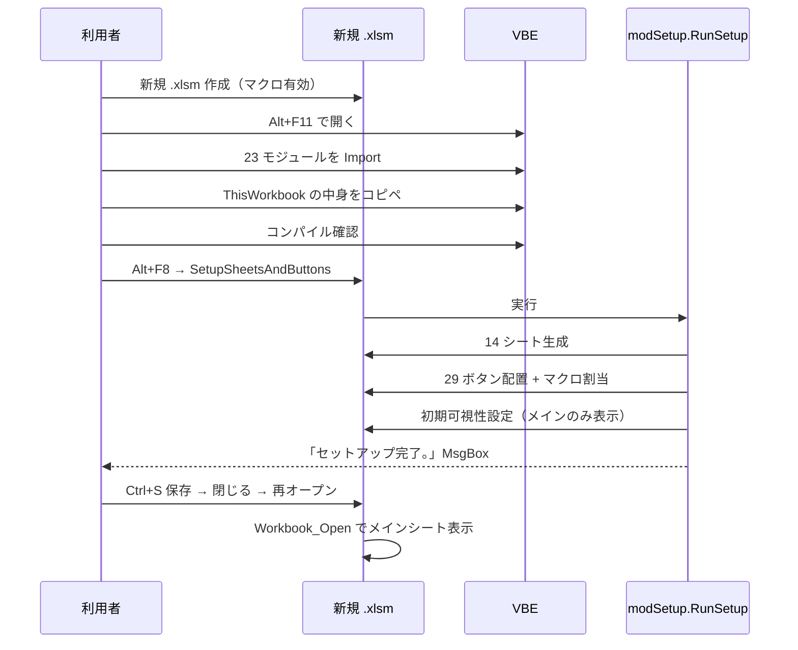
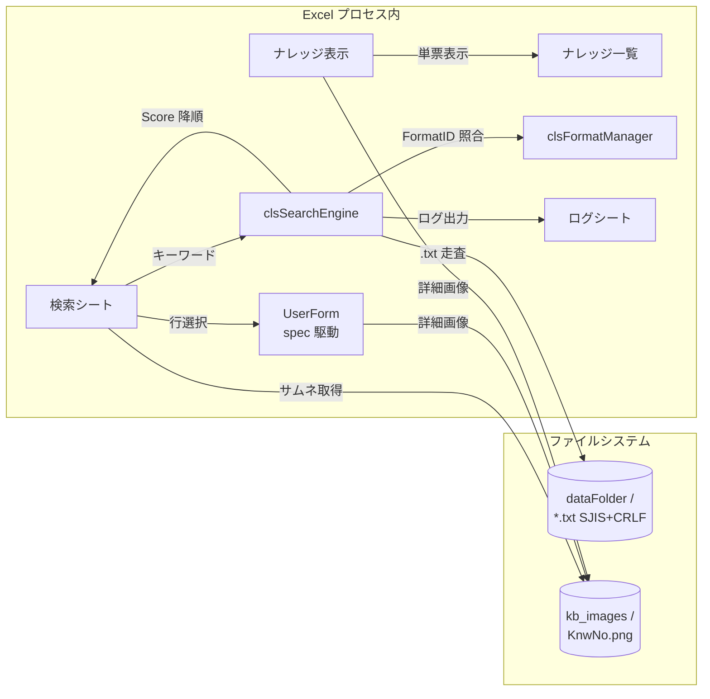

# アーキテクチャ

## 1. 層分離

VBA モジュールは責務ごとに 5 層に分離されています。依存方向は上から下への一方向のみで、ユーティリティ層がビジネスロジック層を呼ぶことはありません。

各層の責務は次のとおり。

| 層 | 役割 | 典型ファイル |
|---|---|---|
| エントリポイント層 | フォームコントロールボタンから直接呼ばれる Public Sub。引数なしまたは `ByVal` 単純型のみ受け取り、ビジネスロジック層に委譲する | `modEntry*.bas` |
| ビジネスロジック層 | クラス中心。検索、ナレッジ管理、フォーマット定義、タスク制御、ストレージ解決、フィールド移行、ログ、UserForm 動的生成 | `cls*.cls` + `modFormBuilder.bas` |
| ユーティリティ層 | 純粋関数とヘルパ。日付、文字列、ファイル I/O、画像描画。**上位層への依存ゼロ** | `mod*Util.bas` + `modCommon.bas` + `modImageRender.bas` |
| インストーラ層 | 1 回限りのセットアップ処理。シート 14 個と 29 ボタンを実行時生成 | `modSetup.bas` |
| 特殊モジュール | `ThisWorkbook`。`Workbook_Open` で初回起動時のみ自動初期化を起動 | `ThisWorkbook.cls` |

## 2. 依存方向の制約

- **エントリポイント → ビジネスロジック → ユーティリティ** の一方向のみ
- **ユーティリティ層から上位層を呼ぶことを禁止**（循環依存防止）
- **`ThisWorkbook` は例外的にインストーラ層を呼ぶ**（初回起動時のセットアップ起動のため）
- **`modFormBuilder` のみ `VBProject.VBComponents` を参照**（spec 駆動 UserForm 生成のため。他モジュールはオブジェクトモデル参照を持たない）

## 3. 配布パターン

### 3.1 「.xlsm 本体は配布しない、モジュールだけ配布する」アプローチ

完成した `.xlsm` をそのまま配布する案には次の問題があります。

1. ユーザがダウンロード時に Excel の保護ビューで開きマクロが既定で無効化される
2. 配布物の `.xlsm` を更新するたびにユーザが手動でファイル差し替える必要がある
3. 開発側が事前に「シート構造 + ボタン配置」を作り込んだ `.xlsm` を毎回保守する必要がある（フォームコントロールを Python 側から書き込むと Excel の修復ダイアログを誘発する）

そこで本ツールは **`.bas`/`.cls` モジュール一式を ZIP で配布し、ユーザは新規 `.xlsm` に VBE から手動 import → セットアップマクロを 1 回実行する** 配布アーキテクチャを採用しています。

### 3.2 セットアップフロー

### 3.3 利点と欠点

**利点**

- 配布物に `.xlsm` が含まれないため、Excel 修復ダイアログ問題から完全に解放
- モジュール単位で diff が見えるため、変更レビューが容易
- ユーザが既存の自分の `.xlsm` にも import できる（複数の `.xlsm` への展開が容易）
- 開発側で「シート構造 + ボタン配置を作り込んだ template `.xlsm`」を保守せずに済む

**欠点**

- ユーザが初回セットアップで VBE を開いて手動 import する手間
- VBE を開く操作に不慣れなユーザ向けに丁寧な手順書が必要
- セットアップマクロが何らかの理由で失敗した場合の状態が中途半端になり得る（途中までシートだけ生成された等）

## 4. データフロー

## 5. 関連 ADR

本ツールの設計判断は `C:\decisions\adr\` 配下の Architecture Decision Records に記録されています。サイト公開上は要約のみ:

| ADR | タイトル | 要旨 |
|---|---|---|
| ADR-0002 | VBA からの子プロセス起動を全面禁止する | 職場 PC では UAC 昇格や黙殺が発生するため、`Shell` / `WScript.Shell.Run` 等は全面禁止。すべて Excel プロセス内で完結 |
| ADR-0008 | VBA は `.bas`/`.cls` モジュールで配布しユーザ側 `.xlsm` に手動 import する | `.xlsm` テンプレートを配布する案は Excel 修復ダイアログ問題を誘発するため、モジュール配布 + セルフセットアップを採用 |
| ADR-0009 | xlsm ビルドは aspose-cells-python で実施する | 開発時の `.xlsm` 自動生成方式を規定（配布物には影響なし、開発反復用） |

## 6. テスト戦略

| レイヤ | テスト対象 | 件数 |
|---|---|---|
| ユーティリティ層 | 純粋関数（文字列、日付、ファイル I/O） | 大半が単体テスト |
| ビジネスロジック層 | 検索スコアリング、ImagePath 解決、FormSpec | T10/T11 系 |
| 配布パターン | セットアップマクロの冪等性、シート存在チェック、ボタン重複削除 | M6 系 |

合計 **PASS 89 / SKIP 4 / FAIL 0**（既存 82 + image_ext rev1 拡張 7）が完了条件です。詳細は [仕様 §7](spec.md#7) を参照。

## 7. 拡張ポイント

将来の変更時に触る予定のファイルを限定するための境界:

- **新フォーマット追加** — `clsFormatManager` のフォーマット定義テーブルを追加、`clsFieldMigrator` で旧→新の写像を定義
- **新しい UserForm を spec 駆動で追加** — `modSpecExamples.bas` を雛形にして `clsFormSpec.AddControl` で宣言、`modFormBuilder.BuildAndShow` で起動
- **新シート追加** — `modSetup.bas` の `RequiredSheets` 配列に追加、ボタン配置の Anchor 範囲も追記

---

## TODO・制約・既知の限界

### 制約

- VBA 子プロセス禁止（Shell/Run/WScript.Shell/Exec）— 職場 PC ポリシー (ADR-0002)
- クラスモジュール (.cls) 内の `Public Const/Type/Declare/Static` 禁止 (ADR-0027)
- aspose-cells-python 単独では VBA binary stub のみ生成、real Excel COM 必須 (ADR-0026)
- mkdocs Material のモバイル UX が完璧ではない（ナビ collapse は OK、図解の細部は要確認）

### 既知の限界

- Excel 単体動作のため Web/モバイルでは利用不可
- 同時編集なし（ファイルベース、Git 等での並行編集が必要）
- 検索性能はモジュール数 O(n) 線形（数千ナレッジまでは実用）

### TODO（v15 以降のロードマップ）

- M-5: modImageRender の RowHeight 副作用排除
- D-3: clsKnowledgeManager / clsSearchEngine / clsTaskController に Worksheet DI 追加
- D-5: 責務固有の Const をクラス側へ移動
- Minor m-1: SHEET_* / FIELD_TYPE_* の Enum 化
- ベンチマーク取得（A+ 到達条件）
- 単体テストカバレッジ整備（A+ 到達条件）

詳細は ADR ([0001-0033](https://github.com/ai-crafted-portfolio/knowledgevba)) を参照。
