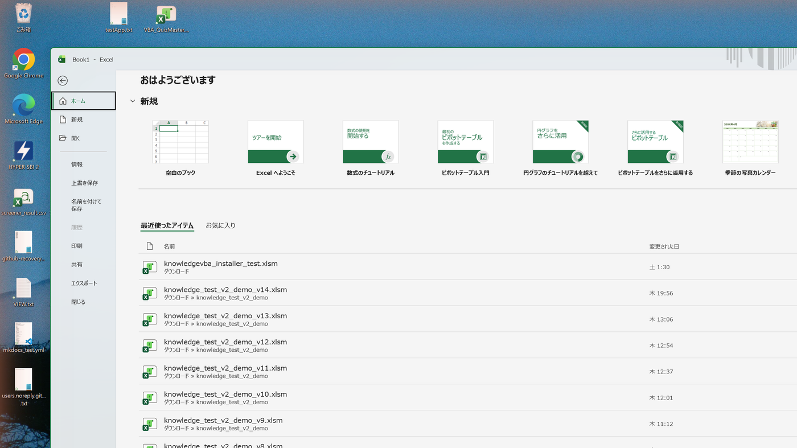
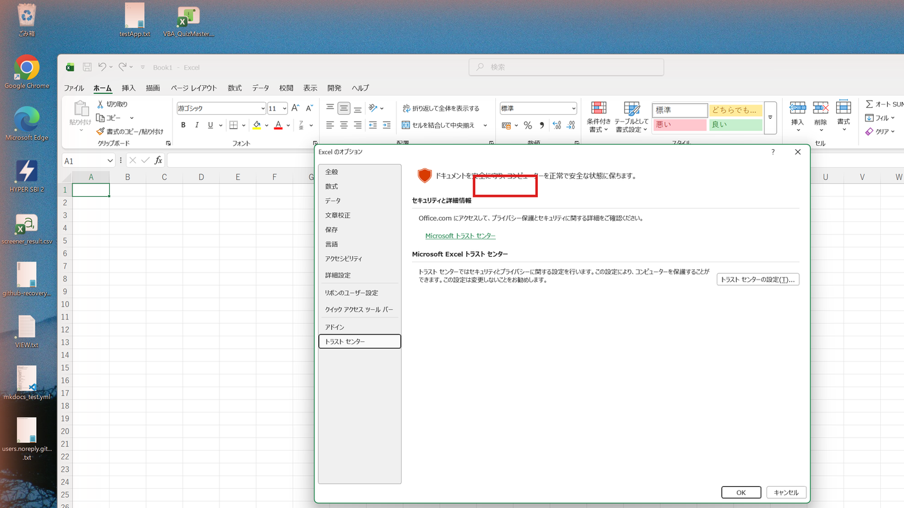
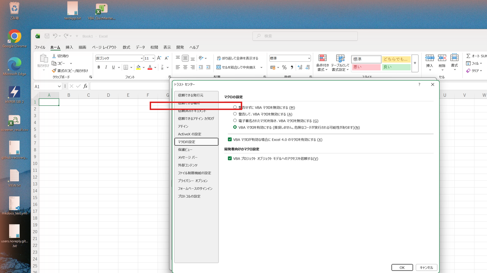
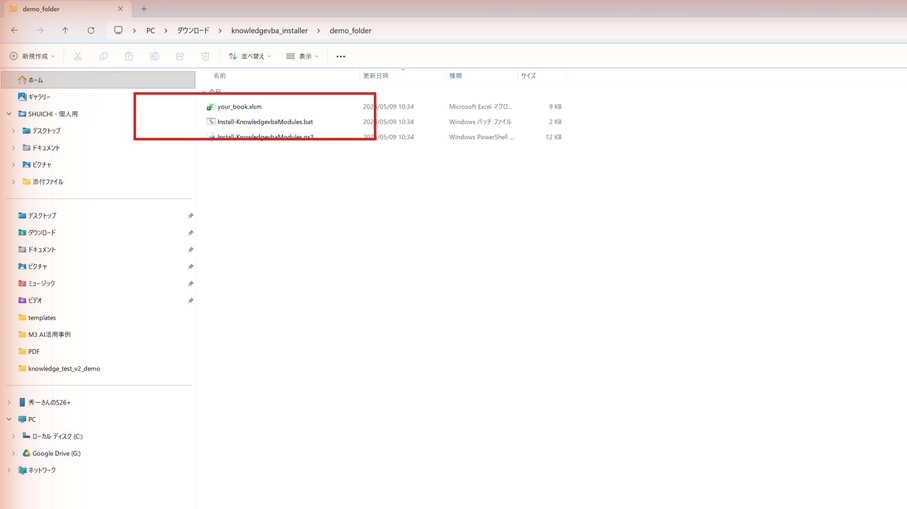
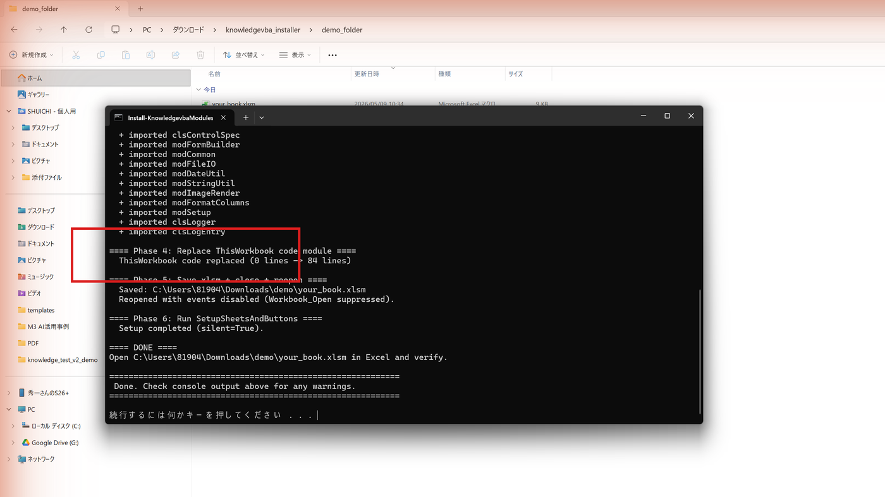

# インストーラ

knowledgevba をあなたの Excel ブックに紐づけて、「ナレッジ登録 / 検索」のボタンが
並んだ画面が使えるようにするためのツールです。

下の **STEP 1 〜 STEP 4** の順にやれば、初めての方でも 10 分ほどで完了します。
各 STEP に画像を添えてあるので、画面上の同じ場所をクリックしてください。

---

## 必要なもの

- Windows 11 か Windows 10 の PC（Windows 標準の機能だけで動きます）
- Microsoft Excel が入っていること（バージョンは何でも OK）

それだけです。GitHub のアカウントや Python・PowerShell の知識はいりません。

---

## STEP 1. Excel の設定を 1 か所だけ変更（最初の 1 回だけ）

このインストーラは VBA（Excel の中で動くマクロ）を、あなたのブックに自動で取り込みます。
Excel の初期設定だと「VBA の自動取り込み」がブロックされているので、最初に 1 か所だけ
チェックを入れます。**この作業は最初の 1 回だけ**で OK です。

### 1-1. Excel を起動して「オプション」を開く

Excel を起動した直後の画面（または何かブックを開いた状態でも OK）で、
画面左下にある **「オプション」** をクリックしてください。

> もし「オプション」が画面左下に見えない場合は、左側のメニュー（ホーム / 新規 / 開く …）を
> 一番下までスクロールしてください。**アカウント** の下に **オプション** があります。

### 1-2. 「トラスト センター」 → 「トラスト センターの設定」を押す

「Excel のオプション」というウィンドウが開きます。

1. 左メニューの一番下にある **「トラスト センター」** をクリック
2. 右側の画面が切り替わるので、出てきた **「トラスト センターの設定(T)…」** という
   ボタンを押す（下の画像の赤枠）

### 1-3. 「マクロの設定」のチェックボックスを ON にする

新しく開いた「トラスト センター」ウィンドウで、左メニューから **「マクロの設定」** を
クリック。右側に **「VBA プロジェクト オブジェクト モデルへのアクセスを信頼する」**
というチェックボックスが出てくるので、これに **チェックを入れて** ください。

### 1-4. 「OK」を 2 回押して閉じる

「トラスト センター」の **OK** → 「Excel のオプション」の **OK** の順に押して、
両方のウィンドウを閉じます。これで Excel 側の事前設定は完了です。

> この設定は Excel に保存されるので、次から STEP 1 はやらなくて OK です。

---

## STEP 2. インストーラ 2 ファイルをダウンロードする

下のリンクから **2 つのファイル** を、**同じフォルダに** ダウンロードしてください。
（保存先は迷ったら **「ダウンロード」フォルダ** で OK です。）

| ファイル | 役割 | リンク |
| --- | --- | --- |
| `Install-KnowledgevbaModules.bat` | これに Excel ブックをドラッグするやつ | [ダウンロード](https://raw.githubusercontent.com/ai-crafted-portfolio/knowledgevba/main/installer/Install-KnowledgevbaModules.bat) |
| `Install-KnowledgevbaModules.ps1` | bat の中で動く処理本体 | [ダウンロード](https://raw.githubusercontent.com/ai-crafted-portfolio/knowledgevba/main/installer/Install-KnowledgevbaModules.ps1) |

リンクを **右クリック → 「名前を付けてリンク先を保存」** で保存できます。
解凍などは不要です。

ダウンロード後、エクスプローラで保存先フォルダを開くと、下の画像のように
**あなたの Excel ブック（例：`your_book.xlsm`） + bat + ps1 の 3 ファイルが
同じフォルダに並んでいる** 状態にしてください（あなたの xlsm をこのフォルダに
コピーしてくれば OK です）。

> **チェック**: ファイル名の末尾は `.bat` と `.ps1` です。Windows の設定で拡張子が
> 表示されていない場合、見た目では区別がつきにくいですが、種類欄に
> 「Windows バッチ ファイル」「Windows PowerShell スクリプト ファイル」と書かれていれば OK。

> **もしダウンロードした bat / ps1 が「ブロックされています」と警告されたら**:
> ファイルを右クリック → プロパティ → 一番下の **「許可する」** にチェックを入れて OK。
> Windows 11 のセキュリティ機能（Mark of the Web）が原因です。

---

## STEP 3. あなたの Excel ブックを bat にドラッグ

1. インストール対象の **`.xlsm` ファイルを Excel で開いていたら、まず閉じてください**
   （bat が裏で Excel を起動するので、二重起動を避けるためです）
2. ドラッグ前のフォルダ画面（STEP 2 の画像と同じ状態）を出して、
   **あなたの `.xlsm` を `Install-KnowledgevbaModules.bat` の上にドラッグ＆ドロップ** します
3. 黒い窓（PowerShell）が立ち上がり、自動でモジュールのダウンロード → 取り込み →
   シートとボタンの自動生成が走ります（30 秒〜1 分くらい）
4. 最後に **「Done.」** と表示されて **「続行するには何かキーを押してください . . .」**
   で待機状態になったら成功です。Enter キーで閉じてください。

> **もし `.xlsm` を持っていない場合**:
> 新しい空の Excel ブックを作って、**「ファイル」 → 「名前を付けて保存」** で
> ファイルの種類を **「Excel マクロ有効ブック (.xlsm)」** にして保存してください。
> 拡張子が `.xlsm` のファイルが必要です（`.xlsx` だと VBA が入らないので使えません）。

---

## STEP 4. Excel で開いて動作確認

完了した `.xlsm` を **ダブルクリックして再度開いてください**。

開くと **「セキュリティの警告 マクロが無効にされました」** という黄色いバーが
画面上部に出ることがあります。**「コンテンツの有効化」** ボタンを押してください
（マクロを使うので、この一手間だけ必要です）。

すると **「メイン」** シートに **「初回セットアップ」「設定変更」「ナレッジ登録」「検索」**
などのボタンが