# 操作マニュアル

このページは **すでにセットアップ済の方が日常運用で使う** ときの画面別操作手順です。各シートの「何ができるか」「ボタンを押すと何が起きるか」「次にどの画面へ進むか」を順に説明します。

ファイルを開くと最初に **メイン** 画面が表示されます。メイン画面下部の 8 個のタスクボタンから目的の画面を選ぶと、関連シートだけが下部のタブに表示される設計です。

---

## 1. メイン

入口の画面です。下部にタスクボタンが 8 個並んでおり、選んだタスクに応じて関連するシートだけが表示されます。

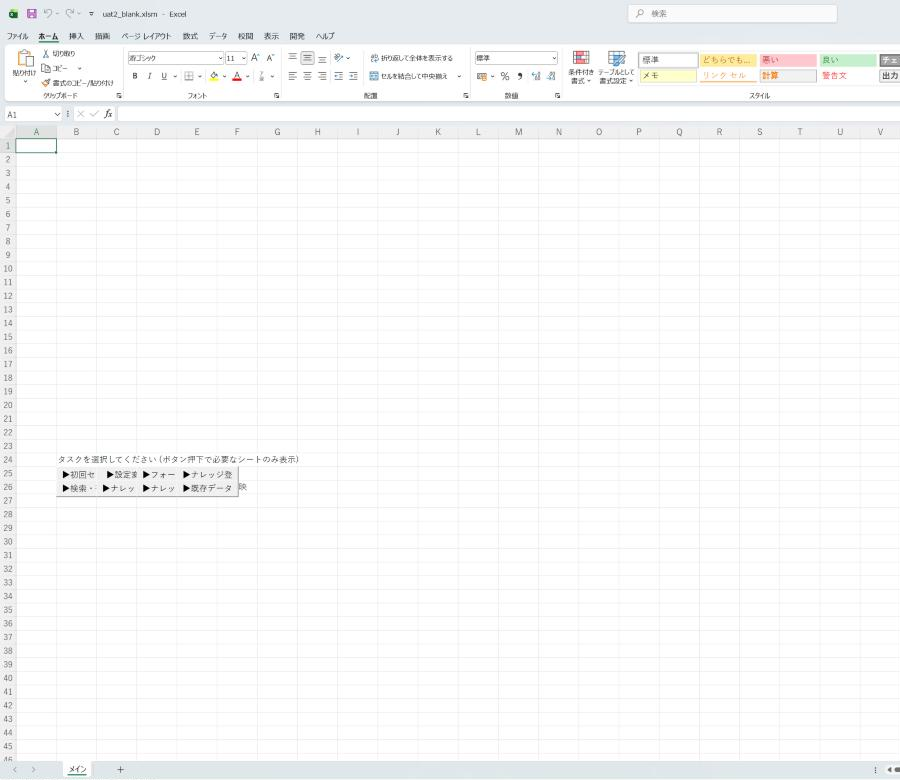

**タスクボタンと遷移先**

| ボタン | この画面に遷移 |
|---|---|
| ▶設定変更 | 格納先設定 / 設定 |
| ▶フォーマット管理 | フォーマット一覧 / フォーマット設計 / フォーマットプレビュー |
| ▶ナレッジ登録 | ナレッジ登録 |
| ▶検索・確認 | 検索 / ナレッジ表示 / ナレッジ修正 |
| ▶ナレッジ修正 | ナレッジ修正 / 検索 / ナレッジ表示 |
| ▶ナレッジ削除 | ナレッジ一覧 |
| ▶既存データ反映 | 既存データへのフィールド反映 |

メインに戻りたいときは、下部タブの **メイン** をクリックしてください。

---

## 2. ナレッジ登録

新規ナレッジを 1 件入力して保存する画面です。フォーマットを選択するとフィールド構成が画面に展開され、入力欄にデータを入れて保存します。

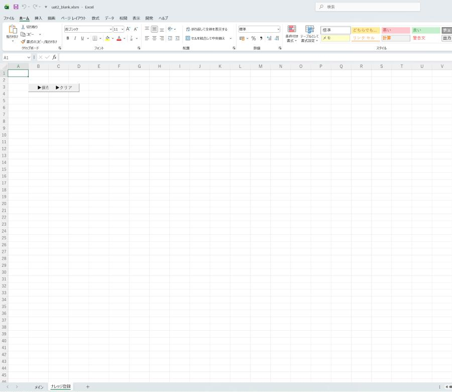

**操作手順**

1. メイン → **▶ナレッジ登録** をクリック
2. 上部の FormatID 欄からフォーマットを選択
3. 各フィールドに値を入力
4. **▶保存** をクリック → 指定の格納先にファイルが書き込まれます
5. 続けて入力する場合は **▶クリア** で入力欄を空にする

**主なボタン**

- **▶保存** … 入力中のフィールドを 1 件のナレッジとして書き出す
- **▶クリア** … 入力欄をすべて空にする

入力に使うフォーマットがまだ無い場合は、先に **6. フォーマット設計** で定義してください。

---

## 3. ナレッジ修正

既存のナレッジを呼び出して内容を上書き保存する画面です。

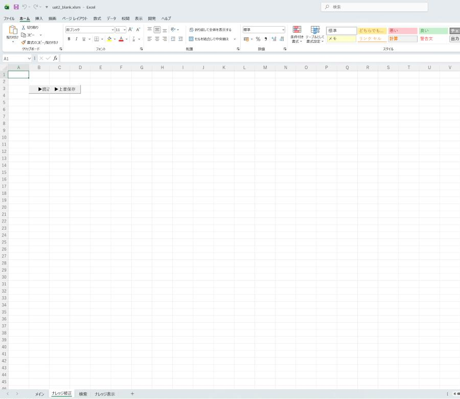

**操作手順**

1. メイン → **▶ナレッジ修正** をクリック
2. 上部の入力欄に対象の KnwNo（ナレッジ番号）を入れる
3. **▶読込** をクリック → 既存内容が各フィールドに展開される
4. 必要箇所を編集
5. **▶上書保存** をクリックして反映

**主なボタン**

- **▶読込** … 指定 KnwNo の既存ナレッジを画面に展開
- **▶上書保存** … 編集内容で既存ファイルを上書き

KnwNo がわからない場合は、**5. 検索** で目的のナレッジを探してから本画面に遷移する流れが便利です。

---

## 4. ナレッジ一覧

登録済ナレッジの一覧を表示し、不要なものを削除する画面です。

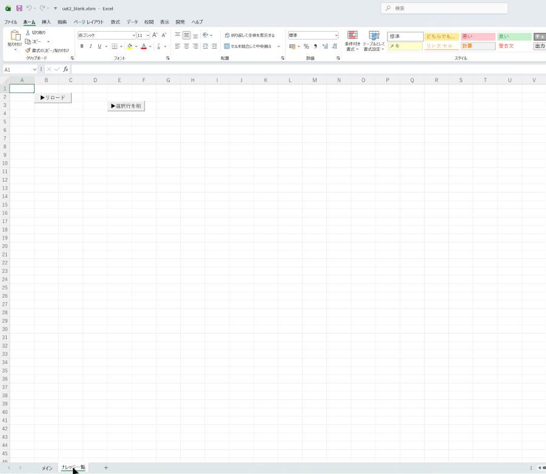

**操作手順**

1. メイン → **▶ナレッジ削除** をクリック
2. **▶リロード** をクリックして最新の登録状況を取得
3. 削除したい行を選択
4. **▶選択行を削除** をクリック → 確認ダイアログで OK

**主なボタン**

- **▶リロード** … 一覧を再構築
- **▶選択行を削除** … 選択中の行に紐づくファイルを削除

---

## 5. 検索

登録済ナレッジを横断検索する画面です。スコアリングされた結果が一覧に表示されます。

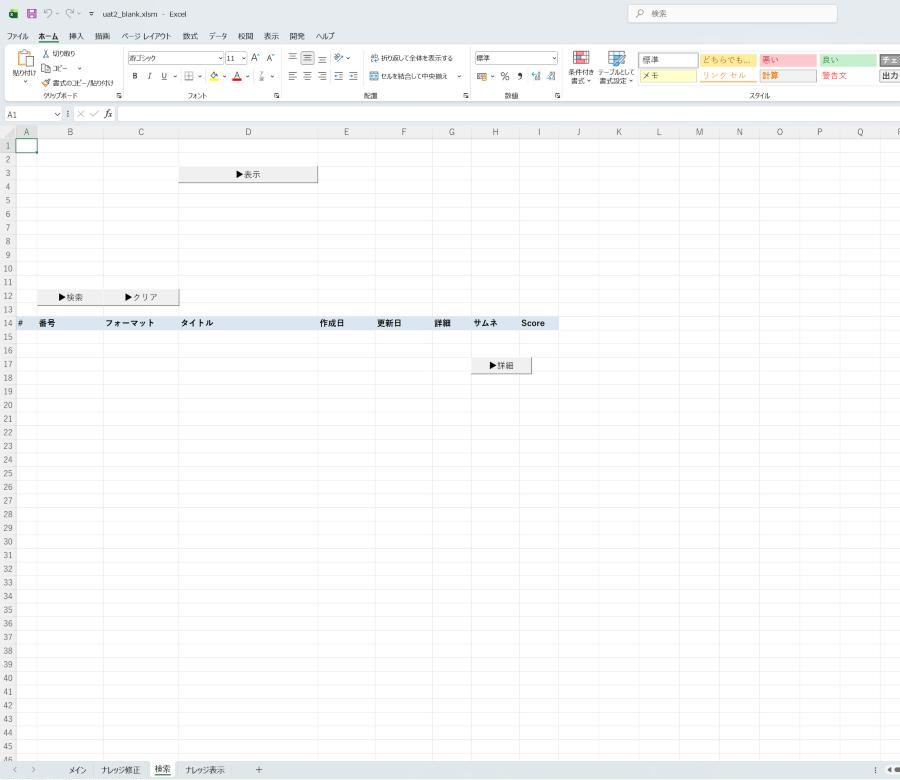

**操作手順**

1. メイン → **▶検索・確認** をクリック
2. キーワード欄に検索語を入力（複数語はスペース区切り）
3. モードで AND / OR を選択
4. TargetField で検索範囲（全フィールド / タイトルのみ等）を指定
5. **▶検索** をクリック → 結果が下部一覧に表示
6. 詳細を見たい行を選択 → **▶詳細** をクリックして **6. ナレッジ表示** に遷移
7. KnwNo がわかっている場合は、上部に番号を入れて **▶表示**

**主なボタン**

- **▶検索** … キーワード検索を実行
- **▶表示** … 直接 KnwNo 指定で開く
- **▶クリア** … 入力条件と結果をクリア
- **▶詳細** … 選択行のナレッジを表示画面で開く

---

## 6. ナレッジ表示

検索結果から開いた個別ナレッジの詳細表示画面です。本文と関連画像（サムネ・詳細画像）が表示されます。

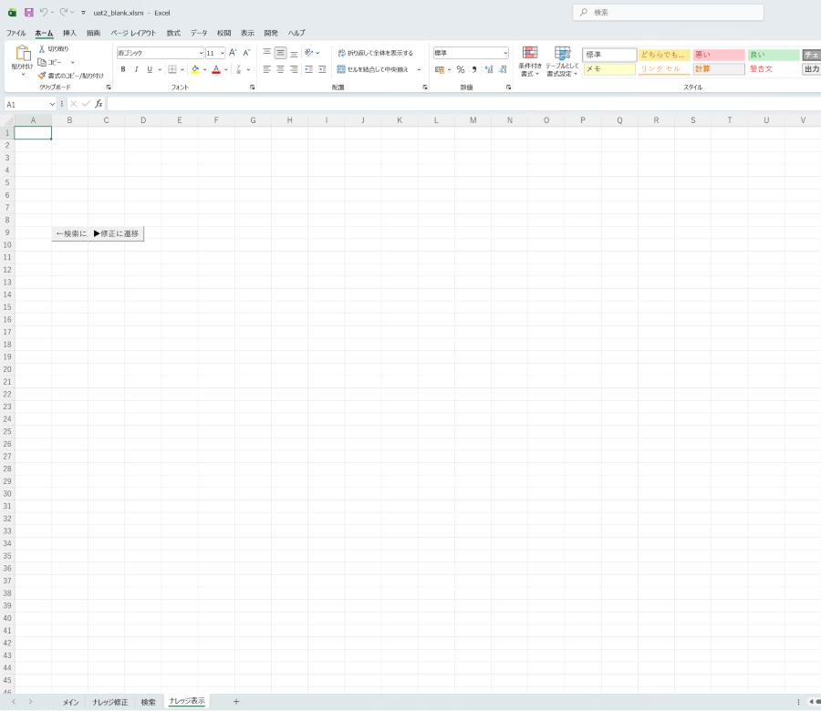

**主なボタン**

- **←検索に戻る** … 検索画面へ戻る
- **▶修正に遷移** … 表示中のナレッジを **3. ナレッジ修正** に引き継いで開く

---

## 7. フォーマット設計

ナレッジのフィールド構造を定義する画面です。FormatID ごとにフィールド名・型を宣言します。

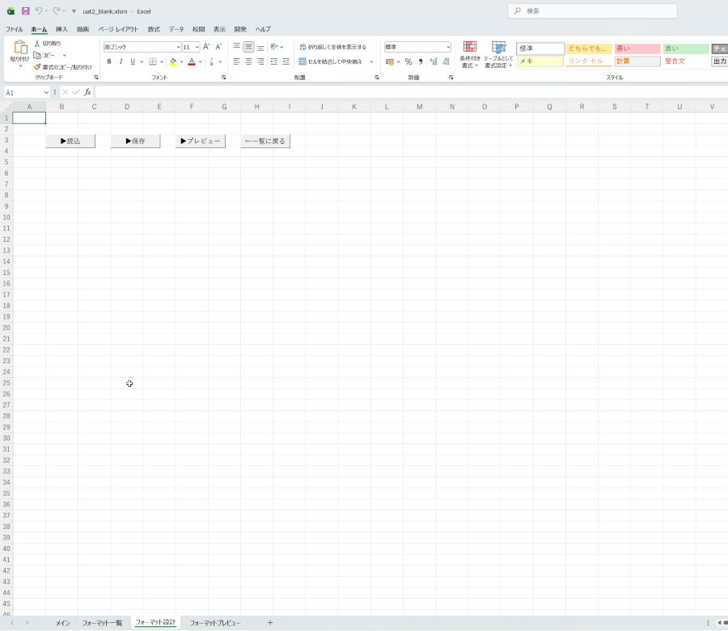

**操作手順**

1. メイン → **▶フォーマット管理** で **8. フォーマット一覧** を開く
2. **▶新規作成** または既存行を選んで **▶選択行を編集** で本画面が開く
3. FormatID と各フィールドを上から定義
4. **▶保存** で保存
5. **▶プレビュー** で **9. フォーマットプレビュー** を確認

**主なボタン**

- **▶読込** … 既存フォーマットを読み込む
- **▶保存** … 設計内容を保存
- **▶プレビュー** … プレビュー画面を開く
- **←一覧に戻る** … フォーマット一覧へ

---

## 8. フォーマット一覧

定義済フォーマットを一覧表示する画面です。

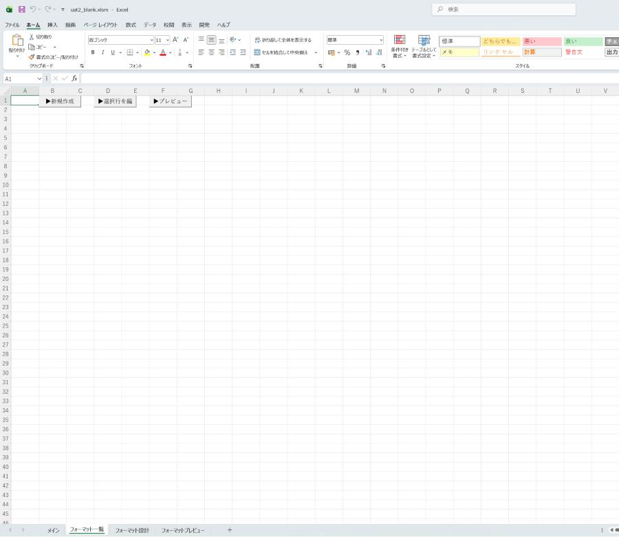

**主なボタン**

- **▶新規作成** … 新規フォーマット設計画面を開く
- **▶選択行を編集** … 選択行のフォーマットを設計画面で開く
- **▶プレビュー** … 選択行のプレビュー表示

---

## 9. フォーマットプレビュー

設計中または既存フォーマットのフィールド構成を視覚的に確認する画面です。**7. フォーマット設計** または **8. フォーマット一覧** から **▶プレビュー** で開きます。

設計内容が反映された見た目を確認できる、参照専用の画面です。

---

## 10. 既存データへのフィールド反映

フォーマットを変更したあと、既存ナレッジへ新しいフィールドを追加・写像するための画面です。

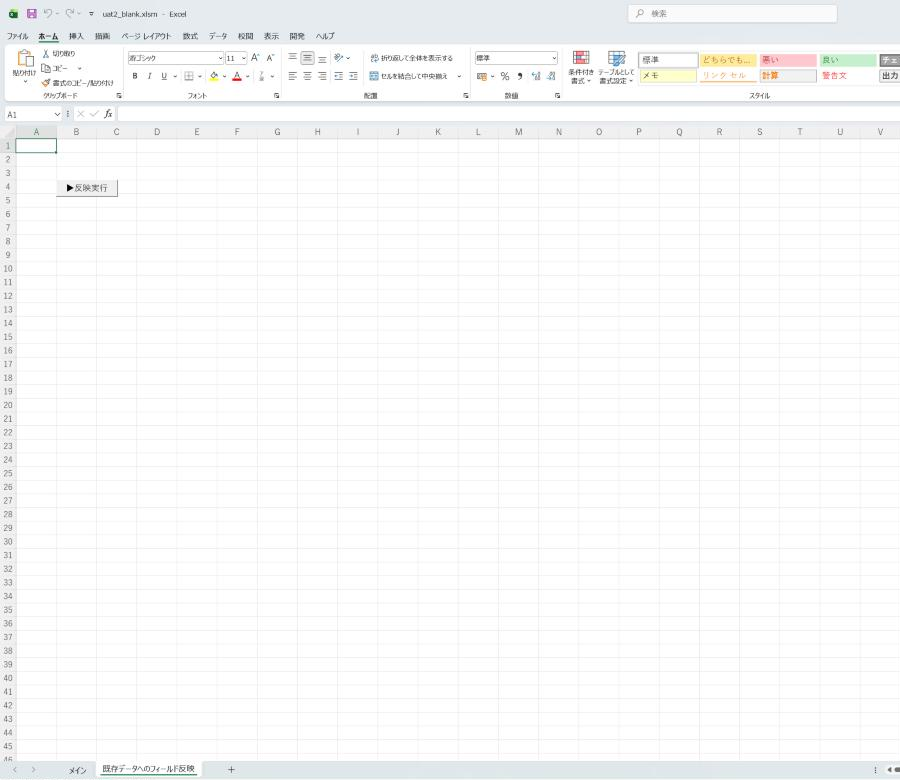

**操作手順**

1. メイン → **▶既存データ反映** をクリック
2. 対象の FormatID と反映ルールを画面で指定
3. **▶反映実行** をクリック
4. 結果は **14. ログ** で確認できます

**主なボタン**

- **▶反映実行** … 対象ナレッジに新フィールドを書き込む

---

## 11. 格納先設定

ドキュメントタイプごとに保存先フォルダを設定する画面です。「共有フォルダ」「BOX」等の保存先タイプとパスを 1 行ずつ書き込みます。

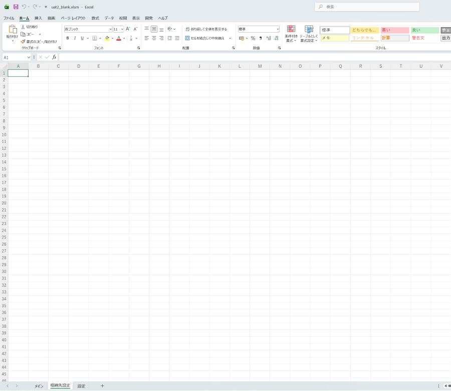

**操作手順**

1. メイン → **▶設定変更** をクリック
2. 表示された画面下部のタブから **格納先設定** を選択
3. 表に DocType / 保存先タイプ / パス を 1 行ずつ書き込む
4. シートを切り替えると即時保存されます（保存ボタンはありません）

設定変更後は、**2. ナレッジ登録** で新規入力するナレッジが指定の格納先に保存されるようになります。

---

## 12. 設定

データフォルダの基準パス、テストモードのオン/オフ等の全体設定を行う画面です。

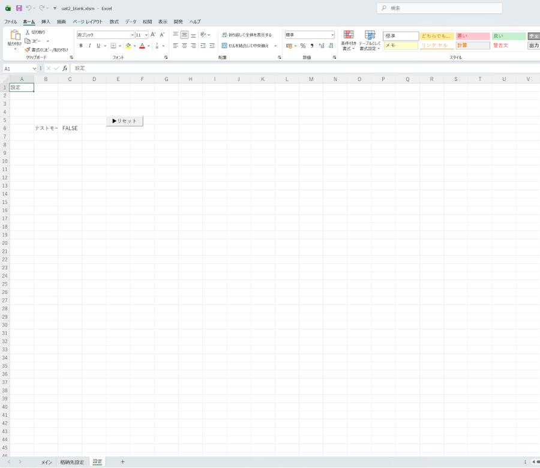

**主なボタン**

- **▶リセット** … 蓄積されたログ（**14. ログ**）をクリアする

テストモードを TRUE にすると一部の処理が試験用の動作になります。通常運用は FALSE のままで問題ありません。

---

## 13. データファイル形式

ナレッジを保存するときのファイル形式を定義するための画面です。

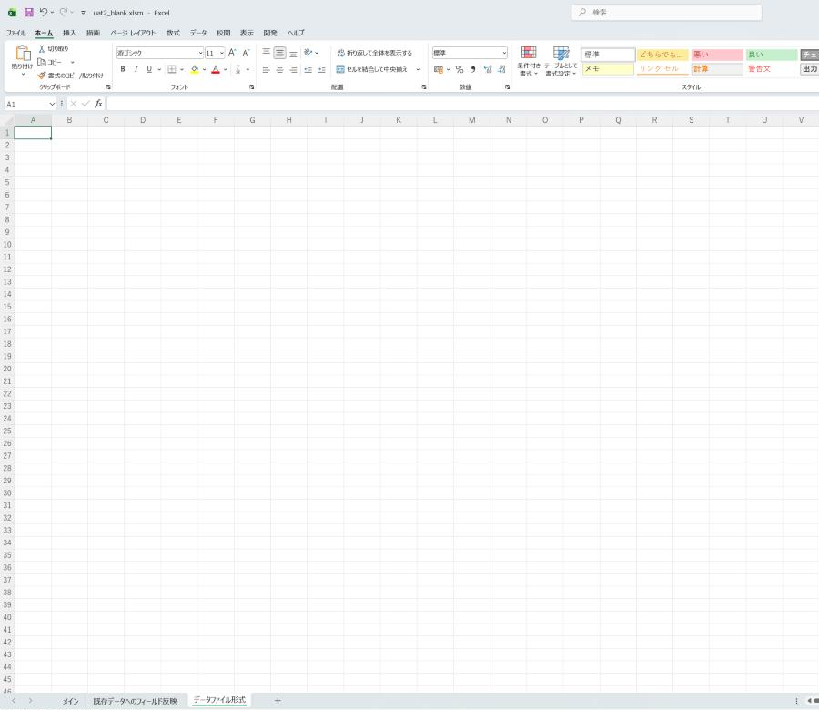

通常は標準のままで動作します。組織独自のファイル形式を持っている場合に、ここで形式の変換ルールを管理します。

---

## 14. ログ

各操作の実行履歴と、エラー・警告が時系列に記録される画面です。

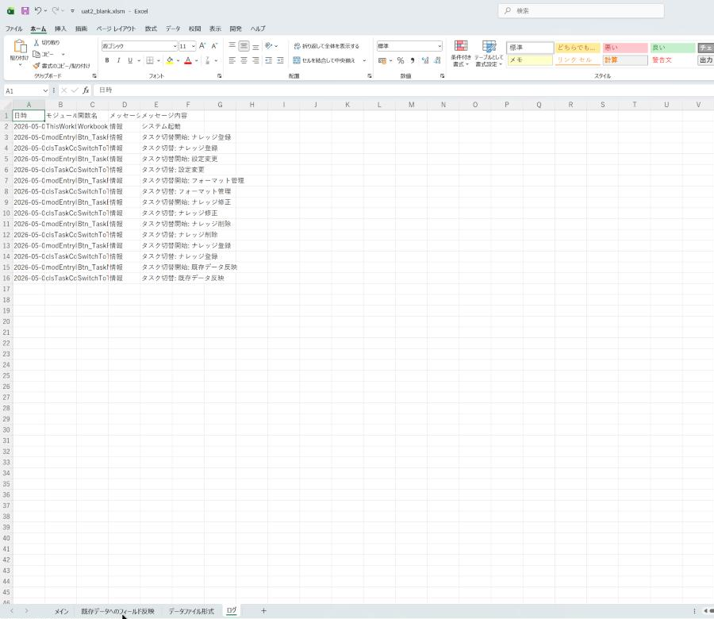

**列の意味**

- **日時** … 操作が起きた時刻
- **モジュール名 / 関数名** … 操作の発生元
- **メッセージ種別** … 「情報」「警告」「エラー」のいずれか
- **メッセージ内容** … 操作内容や警告・エラーの詳細

ログをクリアしたいときは、**12. 設定** の **▶リセット** をクリックしてください。エラーが起きたときは、まずこの画面の **メッセージ種別** が「エラー」の行を確認してください。
