# 操作マニュアル

本アプリを実際に操作する利用者向けの操作マニュアルです。

各章で **画面コピー** と **操作手順** を順を追って解説します。まずは「第 1 章 起動とメイン画面」から読んでください。

---

## 目次

| 章 | タイトル | 関連画面 |
|---|---|---|
| 第 1 章 | [起動とメイン画面](#第-1-章-起動とメイン画面) | M-01 |
| 第 2 章 | [ナレッジを記録する](#第-2-章-ナレッジを記録する) | M-05 |
| 第 3 章 | [ナレッジを探す](#第-3-章-ナレッジを探す) | M-07 / M-08 |
| 第 4 章 | [ナレッジを表示・修正・削除する](#第-4-章-ナレッジを表示修正削除する) | M-09 / M-06 |
| 第 5 章 | [フォーマットを管理する](#第-5-章-フォーマットを管理する) | M-02 / M-03 / M-04 |
| 第 6 章 | [設定を変える](#第-6-章-設定を変える) | M-10 / M-11 / M-13 |
| 第 7 章 | [フィールド反映とログ確認](#第-7-章-フィールド反映とログ確認) | M-12 / M-14 |
| 第 8 章 | [困ったとき (トラブル時)](#第-8-章-困ったとき-トラブル時) | デバッグモード |

---

## 第 1 章 起動とメイン画面

### 1.1 アプリを起動する

事前にインストール (`.bas` インポート + セットアップ実行) が完了していることが前提です。

**起動手順:**

1. **ファイルを開く**: インストール済みの `.xlsm` ファイル (例: `ナレッジ管理.xlsm`) をダブルクリックして開く
2. **マクロを有効化**: Excel 上部に黄色いバー「セキュリティの警告 マクロが無効にされました」が表示されたら、「コンテンツの有効化」ボタンをクリック
3. **メイン画面が表示**: 自動的にメイン画面 (M-01) のみが表示されます。それ以外のシートは「完全非表示」状態となり、業務に必要なシートだけが見える状態になります
4. **初回起動の場合**: 初回起動時は「データフォルダが見つかりません」と表示される場合があります。メイン → ▶システム設定 でデータフォルダパスを設定してください

### 1.2 メイン画面の見方

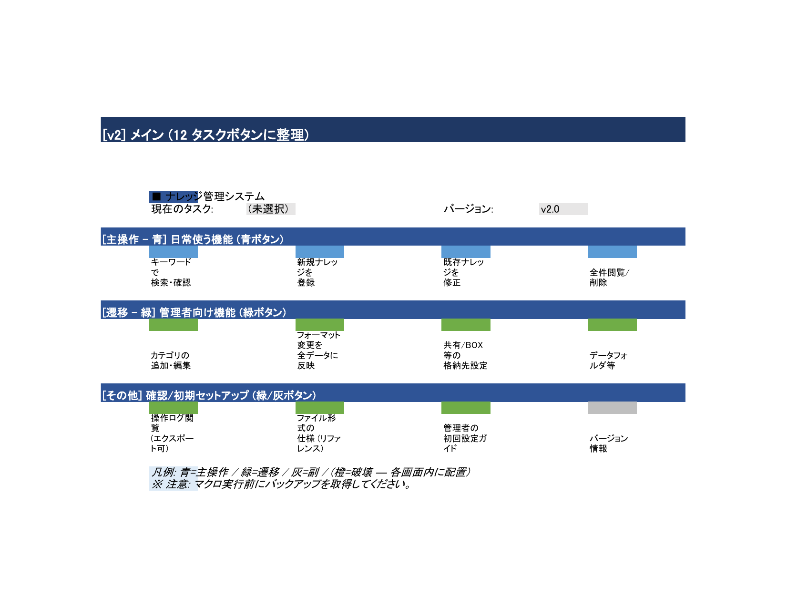

画面上のボタンから次に行いたい作業を選択します。例えば「▶ナレッジ登録」を押すとナレッジ登録画面 (M-05) に切り替わり、「▶検索」を押すと検索画面 (M-08) に切り替わります。

各作業画面では、右下の「← メインに戻る」ボタンでいつでもこの画面に戻れます。

### 1.3 タスクの選択 (12 個のボタン)

メイン画面から各機能に移動するハブ&スポーク型の構成です。

| ボタン | 用途 | 遷移先 |
|---|---|---|
| ▶検索 | キーワードでナレッジを探す | M-08 |
| ▶ナレッジ登録 | 新しいナレッジを記録する | M-05 |
| ▶ナレッジ修正 | 既存ナレッジを編集・削除する | M-06 |
| ▶ナレッジ一覧 | 保存済みナレッジを一覧で見る | M-07 |
| ▶フォーマット管理 | ナレッジの「型」を作る/編集する | M-02 / M-03 |
| ▶フィールド反映 | 型変更を既存データに一括反映する | M-12 |
| ▶格納先設定 | ナレッジの保存場所を管理する | M-10 |
| ▶システム設定 | アプリ全体の設定 | M-11 |
| ▶ログ確認 | 操作履歴を見る | M-14 |
| ▶ファイル形式 | 出力ファイル形式を選ぶ | M-13 |
| ▶初回セットアップ | 再セットアップを実行する | - |
| ▶ヘルプ/バージョン | アプリ情報を表示する | - |

> 💡 **ポイント**: ボタンを押すと関連シートだけが見える状態になります (それ以外は完全非表示)。これにより、業務に関係ないシートを誤って開いて構造を壊すリスクを防いでいます。

---

## 第 2 章 ナレッジを記録する

### 2.1 新規ナレッジを登録する

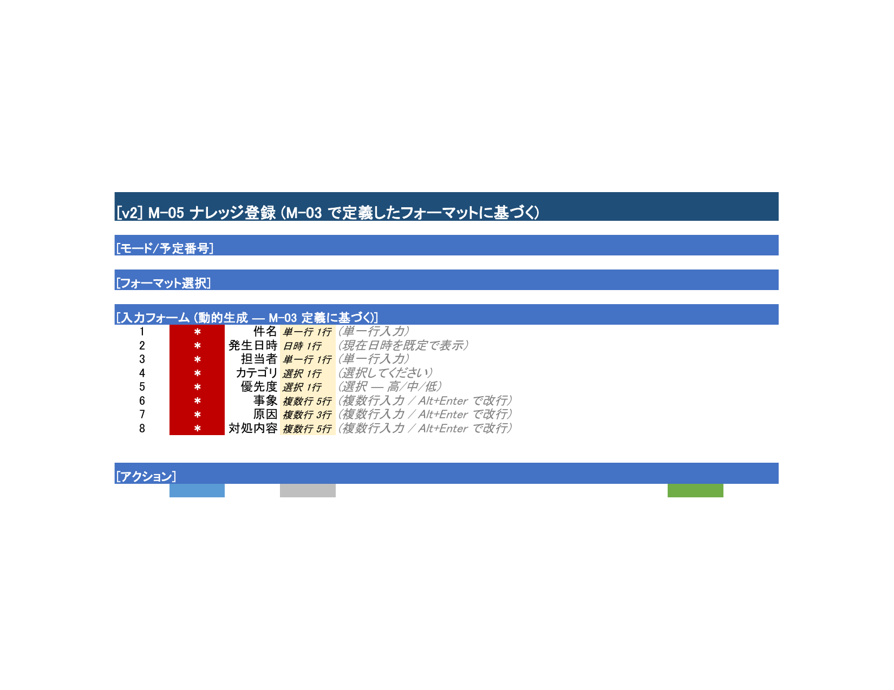

**操作手順:**

1. メイン画面 → **▶ナレッジ登録** をクリック
2. フォーマット (例: 障害対応) を選択
3. `*` マークの必須項目をすべて入力
4. 事象や対処内容は **Alt+Enter** でセル内改行可
5. 画面下の「登録」ボタンをクリック
6. 完了 MsgBox で番号確認 (例: `KN-2026-0420`)

> 💡 **ポイント**: `*` マークが付いた項目は必須入力。未入力で登録するとエラーになります。

### 2.2 多人数で同時に登録した場合

別の利用者が同じ予定番号で同時に保存しようとした場合、システムが自動で次の番号でリトライします (最大 10 回まで)。

#### ケース ① 通常リトライ (1〜数回で衝突解消)

**画面表示:**

> 「予定番号 KN-2026-0420 は他で使われたため、KN-2026-0422 として登録しました」

**あなたが行うこと:**

- OK ボタンを押すだけ。確定番号 (`KN-2026-0422`) でナレッジは正常に保存されています。

#### ケース ② 10 回連続失敗 (極めて稀)

**画面表示:**

> 「採番に失敗しました。しばらく時間を置いて再度お試しください」

**あなたが行うこと:**

- 入力内容は保持されているので、5〜10 分待ってから再度「登録」ボタンを押してください
- 繰り返し発生する場合は管理者に連絡 (ログを確認してもらう)

---

## 第 3 章 ナレッジを探す

### 3.1 ナレッジ一覧を見る

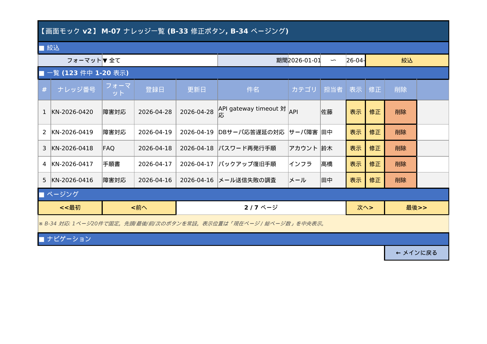

**操作手順:**

1. メイン画面 → **▶ナレッジ一覧** をクリック
2. フォーマット ▼ で絞込 (任意)
3. 期間 from-to で絞込 (任意)
4. 「絞込」ボタンで再表示
5. 20 件ごとにページング (`1/N ページ` 表示)
6. 行の「表示」「修正」「削除」ボタンで遷移

> 💡 **ポイント**: 一覧は手動で「リロード」ボタンを押すまで自動更新されません。

### 3.2 キーワードで検索する

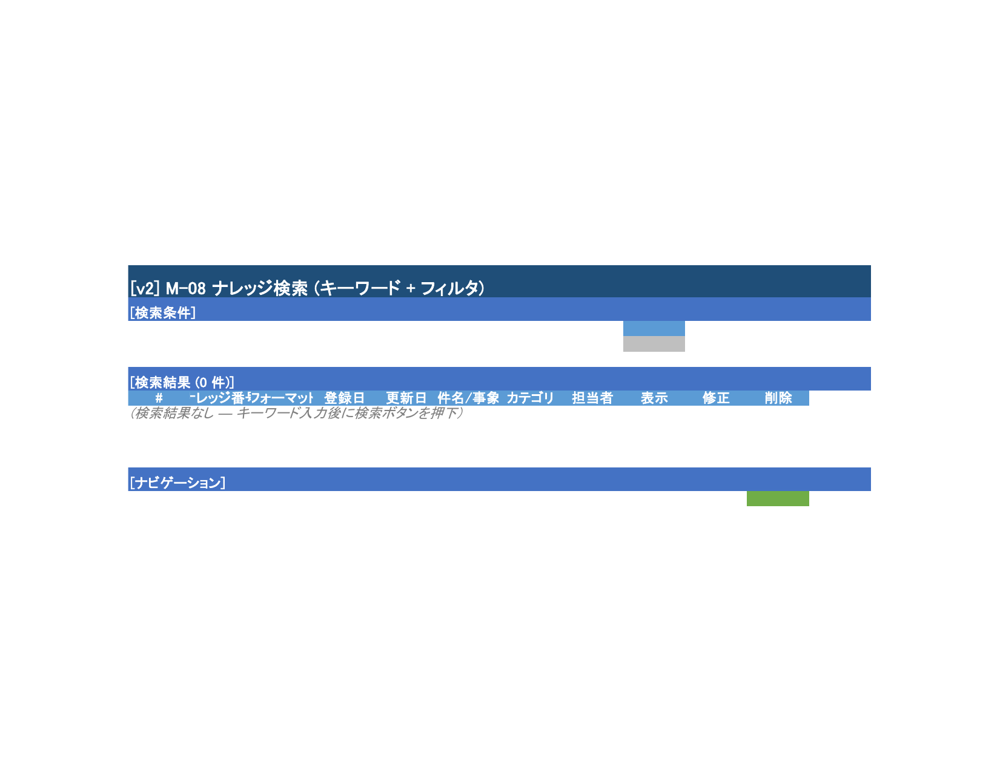

**操作手順:**

1. メイン画面 → **▶検索** をクリック
2. キーワード欄に検索文字を入力
3. 対象フィールド (件名/事象/原因 等) を選択
4. フォーマット ▼ や期間で追加絞込 (任意)
5. 「検索」ボタンで結果表示
6. 結果から「表示」「修正」へ直接遷移可能

> 💡 **ポイント**: スペース区切りで AND 検索 / `"完全一致"` でダブルクォート囲み。

### 3.3 検索条件の詳細 (4 種類)

組み合わせて使うことで絞り込み精度が上がります。

#### AND 検索

```
入力例: DB 遅延
```

スペース区切りで複数キーワードを書くと、すべてを含むナレッジが対象になります。
例: 「DB 遅延」 → 「DB」かつ「遅延」を両方含む

#### 完全一致

```
入力例: "応答遅延"
```

ダブルクォートで囲むと、その文字列を完全に含むナレッジが対象。
例: 「"応答遅延"」 → 「応答遅延」という連続文字列を含む

#### 期間絞込

```
入力例: 2026-01-01 〜 2026-04-30
```

登録日 / 更新日を範囲指定。期間外のナレッジは結果に含まれません。

> ⚠ **注意**: 開始日が終了日より後だとエラーになります。

#### 対象フィールド

```
☑件名 ☑事象 ☑原因 ☑対処内容 ☐再発防止策
```

検索対象とするフィールドを限定 (チェック ON のフィールドのみ)。例: 件名だけで検索するとノイズが減って高速。

---

## 第 4 章 ナレッジを表示・修正・削除する

### 4.1 ナレッジを表示する

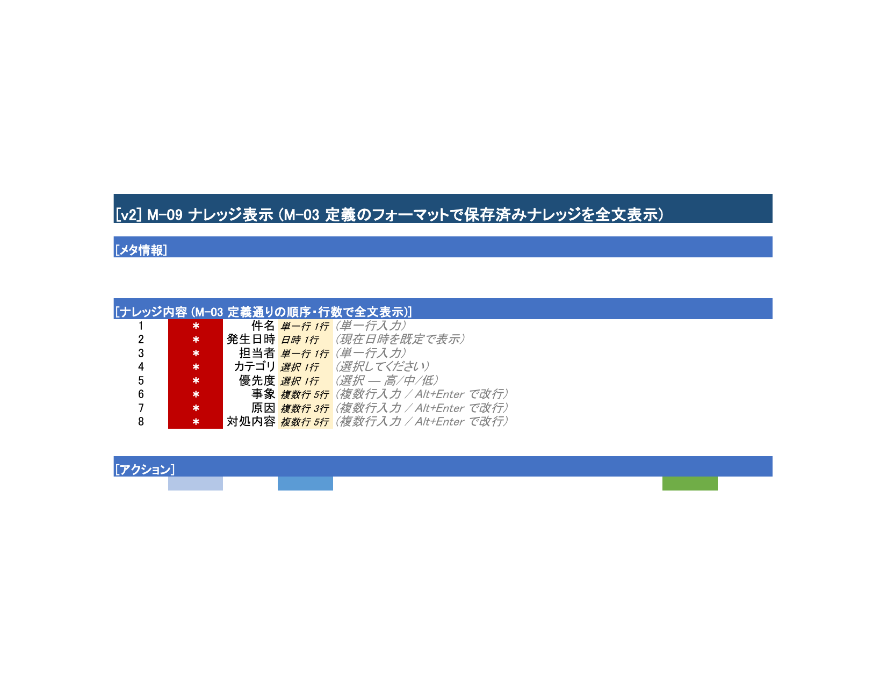

**操作手順:**

1. M-07 一覧 / M-08 検索結果から「表示」をクリック
2. 対象ナレッジが画面に表示される
3. メタ情報 (登録日/更新日/担当者等) を確認
4. 本文 (事象/原因/対処内容/再発防止策) を確認
5. 「修正」ボタンで M-06 修正画面へ遷移
6. 「印刷」ボタンで Word/PDF 等に出力

> 💡 **ポイント**: 長文の複数行フィールドも全文表示されます (行高自動調整で末尾切れなし)。

### 4.2 ナレッジを修正する

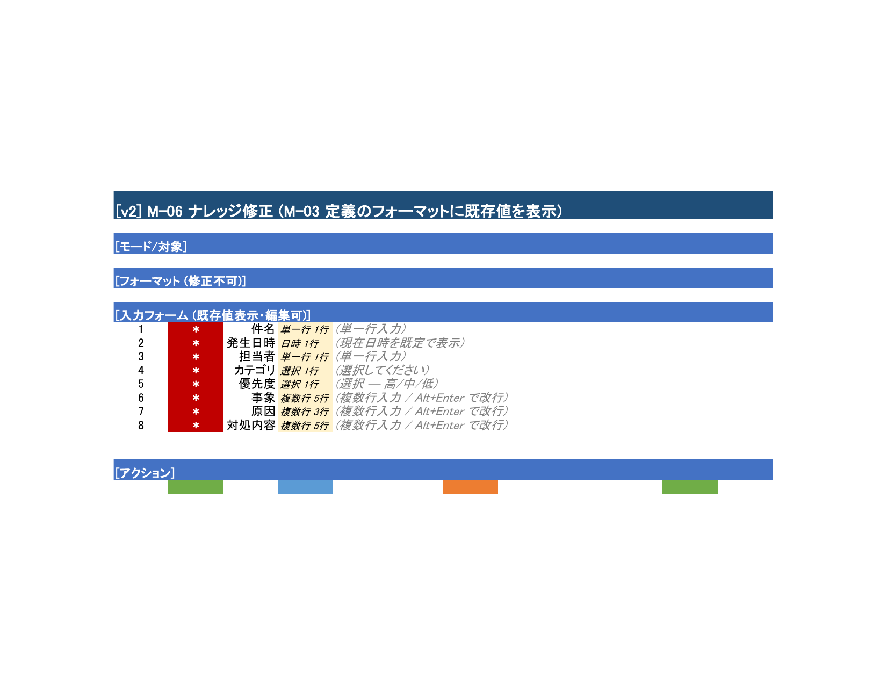

**操作手順:**

1. メイン → **▶ナレッジ修正** をクリック
2. ナレッジ番号 (例: `KN-2026-0419`) を入力
3. 「読込」ボタンでフォームに値が表示
4. 修正したい項目を編集 (`Alt+Enter` で改行)
5. 画面下の「更新」ボタンで上書保存
6. 完了 MsgBox 「KN-2026-0419 を更新しました」

> 💡 **ポイント**: 更新時は CreatedDate (作成日) は変えず、UpdatedDate (更新日) のみ今日に更新されます。

### 4.3 ナレッジを削除する

削除には 2 つの方法があります。

#### 方法 ① 一覧から削除

1. **▶ナレッジ一覧** を開く
2. 削除したい行の「削除」ボタンをクリック
3. 確認ダイアログ「KN-XXXX を削除しますか?」
4. Yes でファイル物理削除
5. `backup/deleted_YYYYMMDD_HHMMSS/` に退避コピーが残る

#### 方法 ② 修正画面から削除

1. **▶ナレッジ修正** で対象を読込
2. 内容を確認
3. 画面下の「このナレッジを削除」(赤色) ボタン
4. 確認ダイアログ
5. Yes でファイル物理削除
6. 削除後は M-07 一覧画面に自動遷移

#### 💡 誤って削除した場合の復旧方法

削除前のファイルは `backup/deleted_YYYYMMDD_HHMMSS/` フォルダに自動退避されています。

エクスプローラーで該当フォルダを開き、`KN-XXXX.xml` ファイルをデータフォルダに手動コピーすれば復旧できます。

復旧手順が分からない場合は管理者に連絡してください (バックアップフォルダのパスは M-11 設定で確認可)。

---

## 第 5 章 フォーマットを管理する

### 5.1 フォーマット一覧を見る

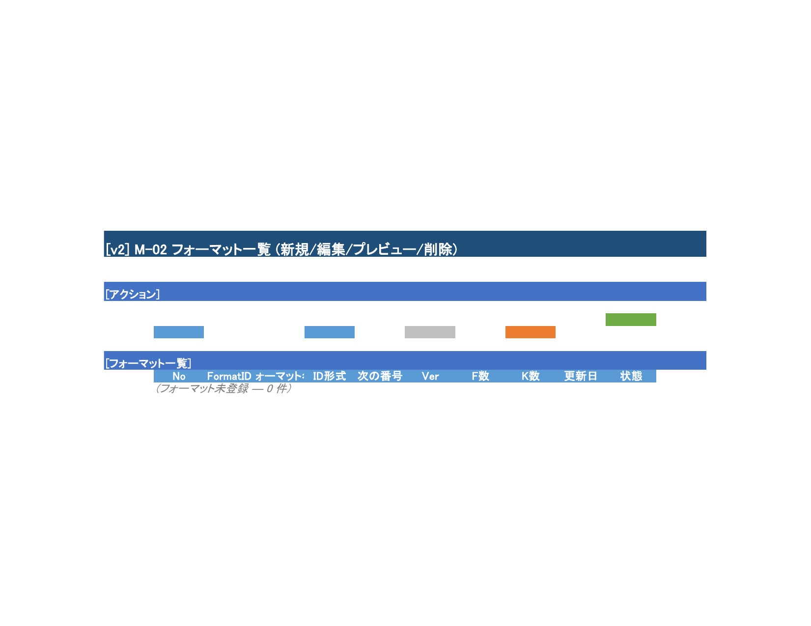

**操作手順:**

1. メイン → **▶フォーマット管理** をクリック
2. フォーマット一覧画面 (M-02) が表示
3. 行の「設計」ボタンで M-03 へ遷移
4. 行の「複製」で別名コピーを作成
5. 行の「削除」ボタンで論理/物理削除
6. 「+ 新規」ボタンで新フォーマット作成

> 💡 **ポイント**: 使用中フォーマットの削除は物理削除でなく論理削除 (フラグ設定) になります。

### 5.2 フォーマットを設計する

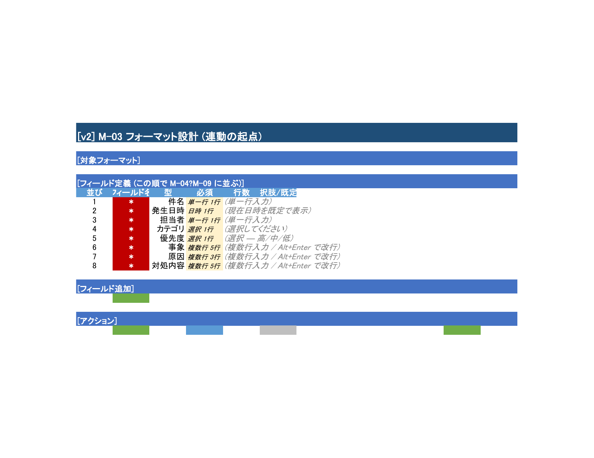

**操作手順:**

1. M-02 で「+ 新規」または「設計」をクリック
2. フォーマット名/ID を入力
3. 「+ フィールド追加」で行を追加
4. 各行で フィールド名/型/必須/行数 を入力
5. ↑↓ ボタンで並び順を変更
6. 「保存」ボタンで確定

> ⚠ **注意**: 「行数」は複数行フィールドの初期高さ (5 行 = 約 90pt)。Excel 行を結合するわけではありません。

### 5.3 プレビューで試打する

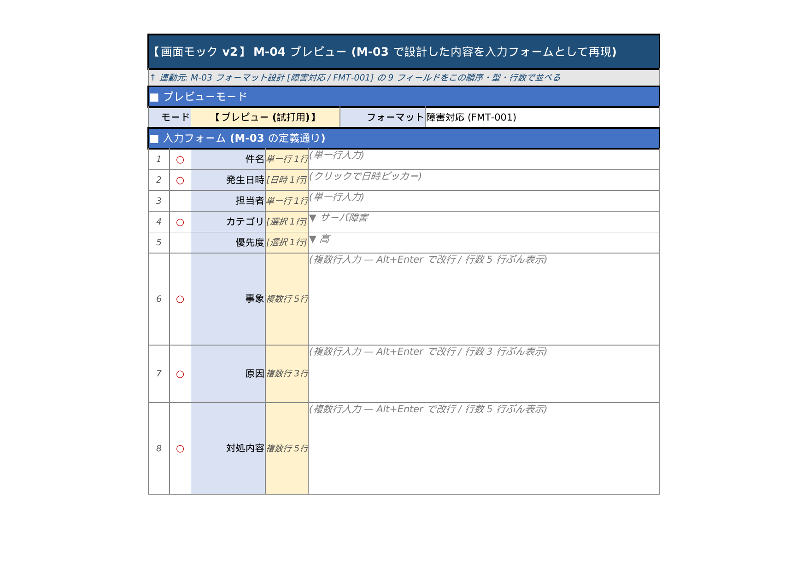

**操作手順:**

1. M-03 で「プレビュー」ボタンをクリック
2. M-05 ナレッジ登録と同じ入力フォーム表示
3. テスト入力で見た目・行高を確認
4. 修正が必要なら「← M-03 設計に戻る」
5. 入力試打のデータは保存されません
6. 満足いくまで M-03 ⇄ M-04 を往復

> 💡 **ポイント**: プレビューでは登録ボタンが無効化されています (実データに保存されません)。

---

## 第 6 章 設定を変える

### 6.1 格納先 (保存場所) を設定する

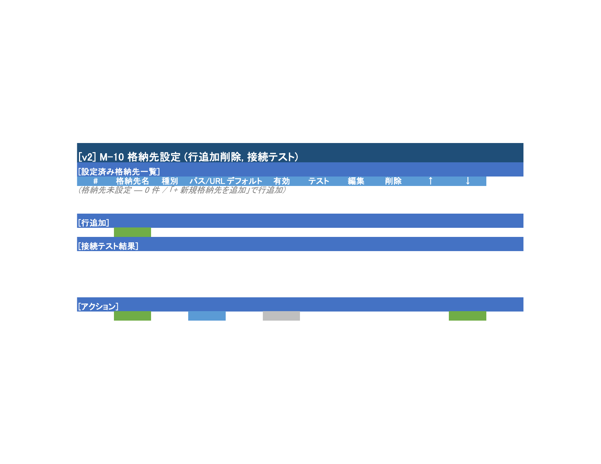

**操作手順:**

1. メイン → **▶格納先設定** をクリック
2. 格納先一覧から行を選択
3. 「+ 新規格納先を追加」で空行を追加
4. 格納先名/種別/パス を入力
5. 「テスト」ボタンで接続確認
6. 「保存」ボタンで設定を確定

> 💡 **ポイント**: 3 種類対応 — ローカル (UNC/Local) / SharePoint / Confluence。各種別に応じた接続情報を入力。

### 6.2 システム設定 (既定値の変更)

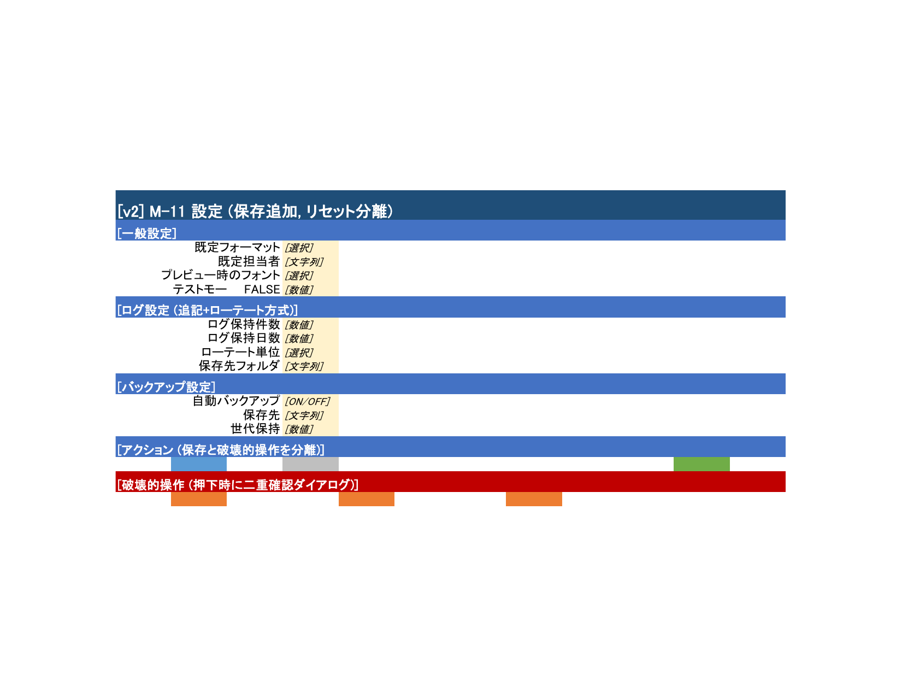

**操作手順:**

1. メイン → **▶システム設定** をクリック
2. 既定フォーマット ▼ や担当者を選択
3. ログレベル (INFO/DEBUG) を選択
4. バックアップ保持期間を設定
5. 採番リトライ上限を設定 (規定 10 回)
6. 「保存」ボタンで設定を確定

> ⚠ **注意**: 画面下部の赤帯セクション「リセット」「全ログ削除」は破壊的操作 (二重確認あり)。

### 6.3 出力ファイル形式を選ぶ

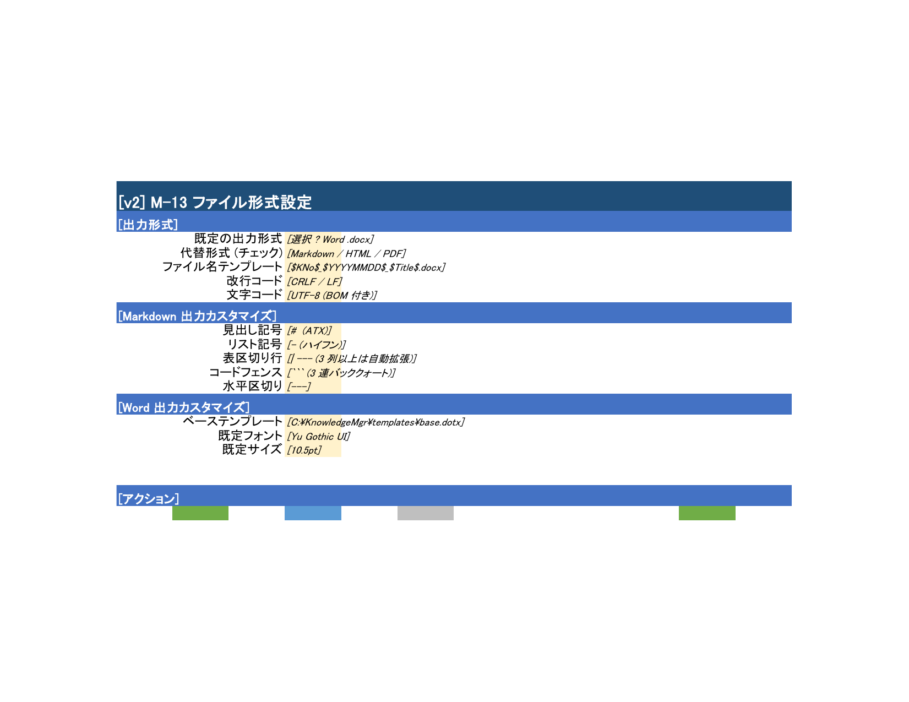

**操作手順:**

1. メイン → **▶ファイル形式** をクリック
2. 既定の出力形式 ▼ (Word/MD/HTML/PDF)
3. ファイル名テンプレートを編集
4. 改行コード (CRLF/LF) を選択
5. 文字コード (UTF-8 BOM) を選択
6. 「保存」ボタンで確定

> 💡 **プレースホルダ**: `$KNo$` (ナレッジ番号), `$YYYYMMDD$` (日付), `$Title$` (件名)

---

## 第 7 章 フィールド反映とログ確認

### 7.1 フォーマット変更を既存ナレッジに反映

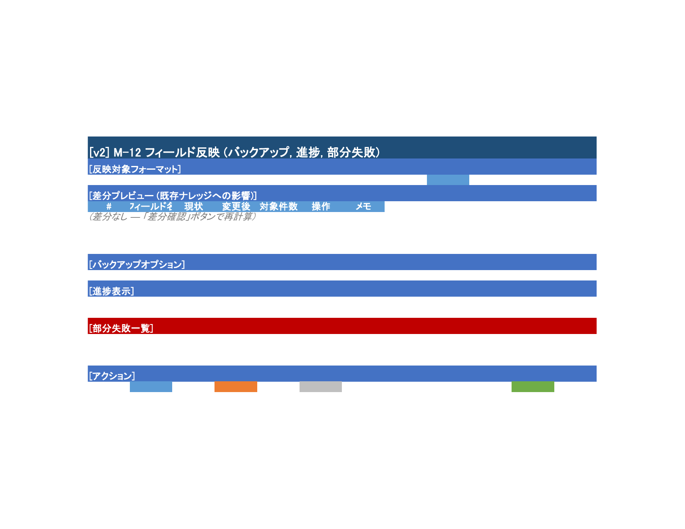

**操作手順:**

1. メイン → **▶フィールド反映** をクリック
2. 対象フォーマット ▼ を選択
3. 「差分確認」で影響範囲を表示
4. 値マッピング (旧値 → 新値) を定義
5. 「反映実行」ボタン (確認ダイアログあり)
6. 事前バックアップ → 進捗表示 → 完了

> ⚠ **注意**: 事前に `backup/reflect_YYYYMMDD_HHMMSS/` に全件退避されます。失敗ナレッジは別表に表示。

### 7.2 操作ログを確認する

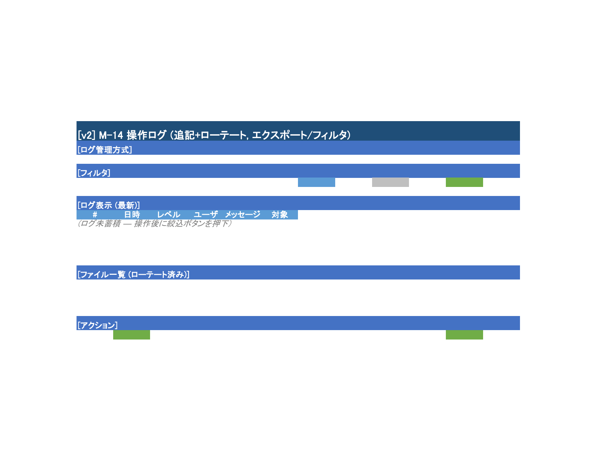

**操作手順:**

1. メイン → **▶ログ確認** をクリック
2. 期間/レベル/ユーザでフィルタ
3. 「絞込」で結果表示
4. ERROR (赤) や WARN (橙) は要注意
5. 「CSV出力」で外部ファイル化
6. 「ログを再読込」で最新状態取得

> 💡 **ポイント**: ログは 10000 行 or 30 日で自動ローテート (古いファイルは保持期間後に自動削除)。

---

## 第 8 章 困ったとき (トラブル時)

### 8.1 デバッグモードを有効にする

システム異常時の調査用に、ログレベルを「DEBUG」に変更することで、内部処理の詳細メッセージが M-14 ログ画面に表示されます。

**有効化手順:**

1. M-01 メイン → **▶システム設定**
2. ログ設定の「ログレベル」を `INFO` → `DEBUG` に変更
3. 「保存」ボタンを押下
4. 問題が再現する操作を実行 (例: ナレッジ登録 → エラー)
5. M-14 ログを開いて DEBUG 含む詳細メッセージを確認
6. 調査完了後、ログレベルを `INFO` に戻す

> ⚠ **注意**: DEBUG モードはログ量が増えます。トラブル調査時のみ ON にし、調査完了後は必ず INFO に戻してください。

### 8.2 よくあるエラーメッセージと対処

M-14 ログ画面で確認できるメッセージ別の推定原因:

| レベル | メッセージ | 原因 | 対処 |
|---|---|---|---|
| **🔴 ERROR** | 「データフォルダが見つかりません」 | サーバ停止/ネットワーク切断 または ▶システム設定 でパス誤り | ① ネットワーク確認 / ② M-11 でパス再設定 → 「テスト」ボタンで OK 確認 |
| **🔴 ERROR** | 「採番に失敗しました。しばらく時間を置いて...」 | 多人数同時保存で採番衝突が 10 回連続発生 | 5〜10 分待って再度「登録」ボタン。継続発生時は管理者に連絡 |
| **🟠 WARN** | 「採番衝突 リトライ 5 回目」 | 採番リトライが 5 回継続中 (多人数同時) | 通常リトライ範囲。5 回未満なら対処不要、頻発時は管理者に通知 |
| **🔴 ERROR** | 「指定されたナレッジは存在しません」 | 番号誤入力 または 他利用者が削除済み | ① 番号を再確認 / ② M-07 一覧で実在確認 / ③ M-11 でデータフォルダパス確認 |
| **🟠 WARN** | 「フィールド反映: KN-XXX で値マッピング失敗」 | 旧値が新選択肢に存在しない | 画面下「部分失敗一覧」で対象確認 → M-06 で個別修正 → 再反映 |

### 8.3 解決しないとき (管理者への連絡)

本ガイドで解決しない場合は以下の情報を準備して管理者に連絡してください:

| # | 項目 | 内容 |
|---|---|---|
| 1 | 操作内容 | 何をしようとしていたか (例: ナレッジ登録、検索、フィールド反映 等) |
| 2 | 画面表示 | エラー MsgBox の文言を写真撮影 or テキストコピー |
| 3 | ログ | M-14 で「CSV出力」を実行 → `log_export_YYYYMMDD_HHMMSS.csv` を添付 |
| 4 | 再現手順 | どの操作で問題が発生するか、毎回発生するか/たまに発生するか |
| 5 | バージョン | メイン → ▶ヘルプ/バージョン で表示される情報 (例: v2.0, ビルド 2026-04-30) |

本ガイドで解決しない場合 / 動作に疑問がある場合は、上記情報を揃えて管理者に連絡してください。

---

## 動作環境

- **OS**: Windows 10 以上
- **Excel**: Microsoft Excel 2016 以上 (.xlsm マクロ有効ブック対応)
- **ネットワーク**: データフォルダへのアクセス可能であること
